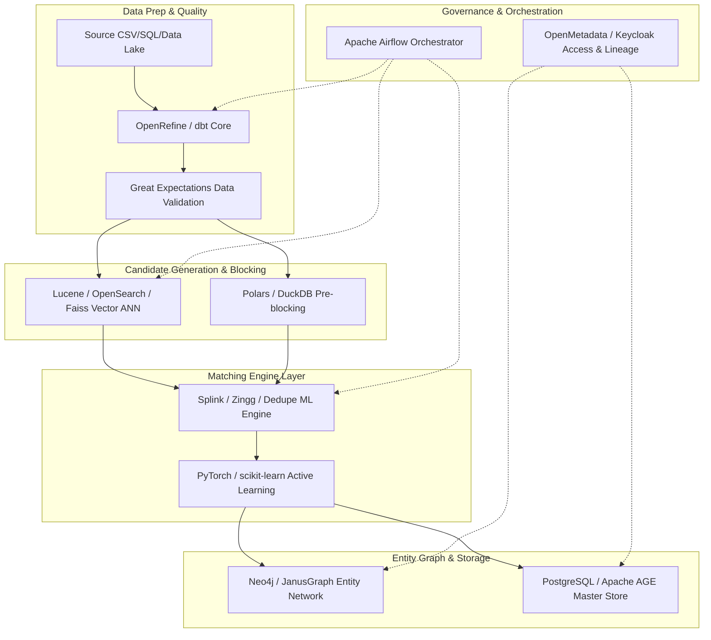

  
  
  
  
  
  

  

# 🚀 Awesome Entity Resolution Platform & Ecosystem

> A curated directory of enterprise **SaaS Platforms**, **Open-Source Libraries**, **Probabilistic Matching Engines**, and **Data Infrastructure** for **Entity Resolution (ER)**, **Record Linkage**, **Data Matching**, **Deduplication**, and **Master Data Management (MDM)**.

---

## 📑 Table of Contents
- [🌐 Market Size & Industry Dynamics](#-market-size--industry-dynamics)
- [🏢 Enterprise SaaS & Hosted ER Platforms](#-enterprise-saas--hosted-er-platforms)
- [⚡ Open-Source GitHub Projects & Libraries](#-open-source-github-projects--libraries)
- [🏗️ Reference Architecture for Self-Hosted ER Platform](#%EF%B8%8F-reference-architecture-for-self-hosted-er-platform)
- [🤝 How to Contribute](#-how-to-contribute)
- [💖 Support & Sponsorship](#-support--sponsorship)
- [📈 Star History](#-star-history)
- [⚖️ Disclaimer](#%EF%B8%8F-disclaimer)

---

## 🌐 Market Size & Industry Dynamics

📊 **Market Size Projection**: The global Entity Resolution, Identity Management, and Master Data Management (MDM) market is estimated at **$5.11 Billion – $9.73 Billion in 2026**, projected to reach **$11.43 Billion – $22.50 Billion by 2033–2035** at a compound annual growth rate (CAGR) of **9.35% – 15.0%**.

🧩 **Market Fragmentation**: The sector is **highly to moderately fragmented**. It spans specialized real-time API engines (Senzing, Quantexa), cloud hyper-scaler services (AWS Entity Resolution, Google Cloud), full-suite Master Data Management (Informatica, Reltio, Ataccama), and open-source probabilistic machine-learning engines (Splink, Zingg, Dedupe).

---

## 🏢 Enterprise SaaS & Hosted ER Platforms

The table below lists notable enterprise entity resolution platforms sorted by **Company Scale (Valuation / Market Cap / Revenue)** in descending order.

| 🏢 Platform | 📊 Company Scale (Revenue / Valuation) | 💰 Specific Starting Pricing | 🎁 Free Tier / Free Trial Limits | 📝 Description & Core Focus |
| :--- | :--- | :--- | :--- | :--- |
| **Google Cloud Entity Resolution** | **~$2.0 Trillion** (Alphabet Cap) | **~$0.20** per 1,000 matches processed | **$300 free trial credits** valid for 90 days | Cloud-native record reconciliation, matching, and Customer 360 pipeline capabilities integrated into GCP. |
| **AWS Entity Resolution** | **~$1.8 Trillion** (Amazon Cap) | **$0.25** per 1,000 records processed | **No standalone free tier** (AWS account includes $100-$300 trial credits across cloud services) | Managed AWS cloud service using rule-based, ML-assisted, and data-provider matching to link records across datasets. |
| **IBM Match 360** | **~$180 Billion** (IBM Market Cap) | **$0.50** per 1,000 API matching calls | **$200 free trial credit** valid for 30 days on IBM Cloud | Cloud Pak for Data native capability for self-service matching, record consolidation, and 360-degree entity governance. |
| **LexisNexis Risk Solutions** | **~$80 Billion** (RELX Group Cap) | **$1,000 / month** minimum enterprise plan | **14-day enterprise proof-of-concept trial** upon sales approval | Risk data and entity intelligence technology offering identity resolution, fraud detection, and relationship analytics. |
| **Palantir Foundry** | **~$60 Billion** (Palantir Cap) | **$1,000 / month** (AWS Marketplace Dev tier) | **30-day free trial** with $500 usage credits | Enterprise ontology platform with identity-centric modeling, relationship discovery, and operational entity resolution. |
| **Snowflake** | **~$50 Billion** (Snowflake Cap) | **$2.00** per Snowflake Credit (Standard) | **30-day free trial** with $400 worth of free usage credits | Cloud data platform facilitating native ER via Snowpark, SQL probabilistic matching, and specialized partner integrations. |
| **Databricks** | **~$43 Billion** (Valuation) | **$0.15** per DBU (Standard Engine) | **14-day free trial** of Databricks Premium workspace | Lakehouse platform running large-scale entity-resolution pipelines using Apache Spark, Delta Lake, and ML models. |
| **Experian** | **~$35 Billion** (Market Cap) | **$500 / month** starting base tier | **14-day sandbox access** upon sales request | Enterprise identity and consumer data platform providing identity resolution, verification, and data quality workflows. |
| **RingLead (ZoomInfo)** | **~$8.0 Billion** (ZoomInfo Cap) | **$3,000 / year** starting platform tier | **14-day free trial** for RingLead Data Quality suite | B2B revenue data platform offering real-time CRM deduplication, record merging, normalization, and lead routing. |
| **Dun & Bradstreet** | **~$6.0 Billion** (D&B Market Cap) | **$49 / month** (D&B Direct API entry tier) | **14-day free trial** with 50 company lookup credits | Commercial business identity resolution provider matching global corporate hierarchies via the D-U-N-S Number. |
| **Informatica** | **~$5.5 Billion** (Informatica Cap) | **$2,000 / month** (IDMC Cloud MDM entry) | **30-day free trial** of Informatica IDMC & Data Prep | Enterprise Cloud MDM platform providing AI-powered identity matching, data quality, Customer 360, and governance. |
| **Precisely (EnterWorks)** | **~$3.5 Billion** (Valuation) | **$1,500 / month** enterprise base license | **30-day free trial** on select data quality products | Data integrity platform providing location intelligence, identity resolution, enrichment, and multidomain MDM. |
| **Quantexa** | **~$1.8 Billion** (Valuation Unicorn) | **$5,000 / month** estimated licensing module | **30-day hosted proof-of-concept sandbox** upon request | Decision intelligence platform utilizing entity resolution and dynamic graph network analytics to combat financial crime and AML. |
| **Reltio** | **~$1.7 Billion** (Valuation Unicorn) | **$2,500 / month** cloud starter edition | **30-day free trial / sandbox environment** | Cloud-native multi-domain Master Data Management platform delivering real-time unified entity profiles and relationship graphs. |
| **BigID** | **~$1.0 Billion** (Valuation Unicorn) | **$1,200 / month** entry module rate | **30-day developer evaluation instance** | Data discovery and privacy platform using ML-driven entity resolution to map sensitive personal data across enterprise stores. |
| **Ataccama ONE** | **~$550 Million** (Valuation) | **$1,000 / month** platform tier | **30-day full-feature free trial** | Automated data management suite combining data quality, MDM, governance, and identity matching into a single engine. |
| **Tamr** | **~$500 Million** (Valuation) | **$3,000 / month** base mastering plan | **14-day guided proof-of-concept evaluation** | Cloud-native data mastering platform utilizing human-in-the-loop machine learning for record consolidation and Golden Records. |
| **Semarchy xDM** | **~$300 Million** (Valuation) | **$1,500 / month** starting cloud license | **30-day free trial** of Semarchy xDM Cloud | Multidomain Master Data Management software offering rapid data matching, record merging, survivorship, and governance. |
| **Profisee** | **~$200 Million** (Valuation) | **$2,000 / month** starter deployment | **30-day software evaluation sandbox** | Enterprise MDM platform providing automated record matching, mastering, and data governance across Microsoft Azure & multi-cloud. |
| **DataWalk** | **~$150 Million** (Valuation - WSE) | **$1,000 / month** starter enterprise node | **14-day free trial / desktop evaluation** | Graph-based analytical platform for connecting, investigating, and resolving entity records across large heterogeneous datasets. |
| **Stibo Systems** | **~$150 Million** (Annual Revenue) | **$2,500 / month** STEP MDM base plan | **30-day proof-of-concept evaluation** | Multidomain MDM enterprise platform specializing in Product (PIM), Customer, and Supplier entity mastering. |
| **Verato** | **~$150 Million** (Valuation) | **$1,000 / month** starting hAPI rate | **30-day sandbox evaluation access** | Next-generation cloud identity resolution platform focusing on healthcare (EMPI) and enterprise longitudinal person profiles. |
| **Melissa** | **~$100 Million** (Annual Revenue) | **$3.00** per 1,000 Personator API credits | **1,000 free lookup credits / month forever** | Global data quality and identity verification platform offering address verification, name matching, and customer deduplication. |
| **Senzing** | **~$50 Million** (Valuation / $15M ARR) | **$0.01** per entity / $1,000 for 100k records/yr | **Free forever for up to 100,000 records** | Real-time AI entity resolution SDK designed to resolve identities locally/on-prem without sending data to third-party servers. |
| **CluedIn** | **~$50 Million** (Valuation) | **$800 / month** starter instance rate | **14-day cloud sandbox trial** | Modern graph-based MDM platform offering automated entity integration, data quality cleaning, and real-time streaming resolution. |
| **Openprise** | **~$20 Million** (Annual Revenue) | **$1,500 / month** revenue automation plan | **14-day guided evaluation trial** | RevOps data automation platform providing identity resolution, lead-to-account matching, deduplication, and data normalization. |
| **Insycle** | **~$10 Million** (Annual Revenue) | **$10 / month** per 2,000 CRM records | **14-day full-feature free trial** | Customer data platform enabling CRM record deduplication, bulk record merging, address standardization, and data cleanup. |

---

## ⚡ Open-Source GitHub Projects & Libraries

Below is the list of top open-source projects, record-linkage libraries, graph databases, search engines, and data compute frameworks sorted by **GitHub Stars** descending.

| 📦 Project Name | 🌟 GitHub Stars | 📝 Category & Description |
| :--- | :--- | :--- |
| **[TensorFlow](https://github.com/tensorflow/tensorflow)** |  | **AI/ML Engine**: Open-source machine learning framework for neural entity matching, embedding generation, and record linkage. |
| **[PyTorch](https://github.com/pytorch/pytorch)** |  | **AI/ML Engine**: Deep learning framework used for representation learning, transformer-based ER (e.g., Ditto), and entity embeddings. |
| **[Elasticsearch](https://github.com/elastic/elasticsearch)** |  | **Search & Candidate Gen**: Distributed search engine providing phonetic matching, fuzzy queries, and vector search for candidate blocking. |
| **[scikit-learn](https://github.com/scikit-learn/scikit-learn)** |  | **Machine Learning**: Standard Python ML library providing classification, distance metrics, and clustering algorithms for deduplication. |
| **[Pandas](https://github.com/pandas-dev/pandas)** |  | **Data Manipulation**: Data manipulation library serving as the underlying DataFrame engine for Python record linkage tools. |
| **[Apache Airflow](https://github.com/apache/airflow)** |  | **Orchestration**: Workflow orchestration platform for scheduling batch entity resolution, enrichment, and MDM pipelines. |
| **[Apache Spark](https://github.com/apache/spark)** |  | **Distributed Compute**: Unified analytics engine providing the computational engine for distributed entity resolution (Zingg, Splink). |
| **[DuckDB](https://github.com/duckdb/duckdb)** |  | **Analytical Database**: Fast in-process analytical SQL database powering lightweight local probabilistic record linkage (Splink). |
| **[Faiss](https://github.com/facebookresearch/faiss)** |  | **Vector Search**: Library for efficient similarity search of dense vectors, enabling vector-based candidate matching. |
| **[Polars](https://github.com/pola-rs/polars)** |  | **High-Perf DataFrame**: Extremely fast Rust-backed DataFrame library used for ultra-fast record blocking and preprocessing. |
| **[Keycloak](https://github.com/keycloak/keycloak)** |  | **Security & Access**: Open-source identity and access management platform for securing multi-tenant ER platforms. |
| **[MLflow](https://github.com/mlflow/mlflow)** |  | **ML MLOps**: Open-source platform for tracking experiments, versioning entity-resolution models, and registering endpoints. |
| **[Apache Flink](https://github.com/apache/flink)** |  | **Stream Processing**: Stateful stream processing framework for executing real-time streaming entity resolution. |
| **[Neo4j](https://github.com/neo4j/neo4j)** |  | **Graph Database**: Native graph database for storing resolved entities, relationship networks, and graph analytics. |
| **[Kubeflow](https://github.com/kubeflow/kubeflow)** |  | **Kubernetes ML**: Cloud-native machine learning toolkit for deploying enterprise-scale ER model training pipelines. |
| **[OpenMetadata](https://github.com/open-metadata/OpenMetadata)** |  | **Data Governance**: Metadata platform providing lineage tracking, entity schemas, and governance over unified master data assets. |
| **[ArangoDB](https://github.com/arangodb/arangodb)** |  | **Multi-Model Graph DB**: Multi-model database supporting graph and document models for entity network investigation. |
| **[dbt Core](https://github.com/dbt-labs/dbt-core)** |  | **Analytics Engineering**: Analytics engineering tool for transforming, cleaning, and standardizing tabular data prior to matching. |
| **[OpenSearch](https://github.com/opensearch-project/OpenSearch)** |  | **Search Engine**: Open-source distributed search engine for text matching, fuzzy lookup, and vector indexing. |
| **[DataHub](https://github.com/datahub-project/datahub)** |  | **Data Catalog**: Metadata platform enabling discovery, data lineage, and governance for enterprise entity resolution systems. |
| **[Open Policy Agent (OPA)](https://github.com/open-policy-agent/opa)** |  | **Policy Engine**: Policy engine enforcing security, attribute-based access control (ABAC), and PII masking on matched entities. |
| **[OpenRefine](https://github.com/OpenRefine/OpenRefine)** |  | **Data Cleaning**: Data transformation power tool with built-in clustering (fingerprint, knn, levenshtein) and reconciliation. |
| **[Great Expectations](https://github.com/fivetran/great_expectations)** |  | **Data Quality**: Open-source data quality testing framework for asserting source data contracts and validating entity outputs. |
| **[JanusGraph](https://github.com/JanusGraph/janusgraph)** |  | **Distributed Graph DB**: Scalable distributed graph database for managing massive entity-relationship knowledge graphs. |
| **[HNSWlib](https://github.com/nmslib/hnswlib)** |  | **ANN Similarity Search**: Header-only C++/Python library for fast approximate nearest neighbor candidate generation. |
| **[Apache AGE](https://github.com/apache/age)** |  | **PostgreSQL Graph**: PostgreSQL extension that adds graph database capabilities (openCypher) for entity network queries. |
| **[Dedupe](https://github.com/dedupeio/dedupe)** |  | **Dedicated ER Framework**: Python library for machine-learning-based fuzzy matching, record deduplication, and active learning. |
| **[TheFuzz](https://github.com/seatgeek/thefuzz)** |  | **Fuzzy String Matching**: Python library for computing Levenshtein distance ratio, token sort, and partial string comparisons. |
| **[Splink](https://github.com/moj-analytical-services/splink)** |  | **Dedicated ER Engine**: Fast probabilistic data linkage engine implementing Fellegi-Sunter models with DuckDB & Spark backends. |
| **[Apache Atlas](https://github.com/apache/atlas)** |  | **Governance Framework**: Metadata management and governance framework for tracking master data lineage across Hadoop and cloud. |
| **[Zingg](https://github.com/zinggAI/zingg)** |  | **Dedicated ER Platform**: Open-source ML-based entity resolution and MDM platform with active learning built on Apache Spark. |
| **[Python Record Linkage Toolkit](https://github.com/J535D165/recordlinkage)** |  | **Record Linkage Toolkit**: Python library providing indexing/blocking, record comparison, similarity scoring, and classification. |
| **[Duke](https://github.com/larsga/Duke)** |  | **Java Deduplication Engine**: Fast deduplication and record linkage engine written in Java, leveraging Apache Lucene for blocking. |
| **[DeepMatcher](https://github.com/anhaidgroup/deepmatcher)** |  | **Deep Learning ER**: Python package using deep learning (RNNs, Attention) for entity resolution and fuzzy record matching. |
| **[string_grouper](https://github.com/Bergvca/string_grouper)** |  | **Fast String Matching**: High-performance Python library using TF-IDF and N-gram cosine similarity matrix multiplication. |
| **[Ditto](https://github.com/megagonlabs/ditto)** |  | **Pre-trained LM Matching**: Deep entity matching system leveraging pre-trained language models (BERT, RoBERTa) with domain adaptation. |
| **[fastLink](https://github.com/kosukeimai/fastLink)** |  | **Probabilistic Record Linkage**: R package implementing fast Fellegi-Sunter probabilistic record linkage with missing data support. |
| **[JedAI Toolkit](https://github.com/scify/JedAIToolkit)** |  | **Java ER Toolkit**: Scalable Java toolkit for graph-based and blocking-based entity resolution across relational and RDF data. |
| **[RLTK](https://github.com/usc-isi-i2/rltk)** |  | **Record Linkage Framework**: General-purpose Python framework for building record linkage workflows with custom similarity functions. |
| **[pyJedAI](https://github.com/AI-team-UoA/pyJedAI)** |  | **Python ER Framework**: Native Python library for construct end-to-end entity resolution, block building, and linkage pipelines. |
| **[Anonlink](https://github.com/data61/anonlink)** |  | **Privacy-Preserving Linkage**: Cryptographic privacy-preserving record linkage tool linking records without disclosing PII. |

---

## 🏗️ Reference Architecture for Self-Hosted ER Platform

---

## 🤝 How to Contribute

Contributions are welcome! Please follow these simple guidelines:
1. 🍴 **Fork** this repository.
2. ➕ **Add** your recommended platform, open-source engine, or library to the appropriate table.
3. 🔗 Ensure SaaS entries include valid starting pricing and free trial details, and Open-Source entries include the correct GitHub star badge linking to `stargazers`.
4. 📥 Submit a **Pull Request** with a clear title and description.

Check out [Awesome-Awesome-Awesome](https://github.com/ishandutta2007/Awesome-Awesome-Awesome) for more curated lists!

---

## 💖 Support & Sponsorship

If you find this repository helpful for your data engineering, AI, or Master Data Management projects, please consider supporting the project:

- 🌟 **Star** this repository to help others discover it!
- 🔀 **Fork** it to customize or contribute back.
- ☕ **Buy me a coffee**: Support ongoing open-source maintenance via the [GitHub Sponsor Dashboard](https://github.com/sponsors/ishandutta2007).

---

## 📈 Star History

---

## ⚖️ Disclaimer

This list is curated for informational purposes and does not constitute an explicit ranking or endorsement. SaaS product pricing, enterprise valuations, and open-source star metrics change over time; always verify directly with vendor sales and official repositories prior to production deployment.
